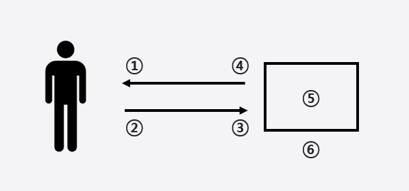

# Challenge

This is the English solution to the .

## Table of contents

- [Overview](#overview)
  - [Expectation](#expectation)
  - [Links](#links)
- [My process](#my-process)
  - [Built with](#built-with)
  - [What I learned](#what-i-learned)
  - [Continued development](#continued-development)
  - [Useful resources](#useful-resources)
- [Author](#author)

## Overview

### Expectation

Users should be able to:

- View the optimal layout depending on their device's screen size
- See hover states for interactive elements

### Links

- Live Site URL: :globe_with_meridians: [Add live site URL here](https://your-live-site-url.com)
- Github URL : :file_cabinet: [Add live site URL here](https://your-live-site-url.com)
- Solution URL: :crystal_ball: [Add solution URL here](https://your-solution-url.com)

## My process

### Built with

- Semantic HTML5 markup
- CSS custom properties
- Flexbox
- CSS Grid
- Mobile-first workflow
- [React](https://reactjs.org/) - JS library
- [Next.js](https://nextjs.org/) - React framework
- [Styled Components](https://styled-components.com/) - For styles

### What I learned

1. Present data beautifully
2. Manipulating data (screen)
3. Send data to server
4. Handling data received from the server
5. Manage development environment, deploy to server
6. Development for developers

[Source: (테오의 프론트엔드)[https://yozm.wishket.com/magazine/detail/1294/]]

### Continued development

- Example: Something :white_check_mark:

### Useful resources

- [Example resource 1](https://www.example.com) - This helped me for XYZ reason. I really liked this pattern and will use it going forward.
- [Example resource 2](https://www.example.com) - This is an amazing article which helped me finally understand XYZ. I'd recommend it to anyone still learning this concept.

## Author

Byungmin Choi (bmchoi803@gmail.com)

- Website - [byungmin-choi.com](http://byungmin-choi.com)
- Github - [github.com/PhilosopherProgrammer](https://github.com/PhilosopherProgrammer)
- Blog - [philosopherprogrammer.com](https://philosopherprogrammer.com/)
- Frontend Mentor - [@PhilosopherProgrammer](https://www.frontendmentor.io/profile/PhilosopherProgrammer)
